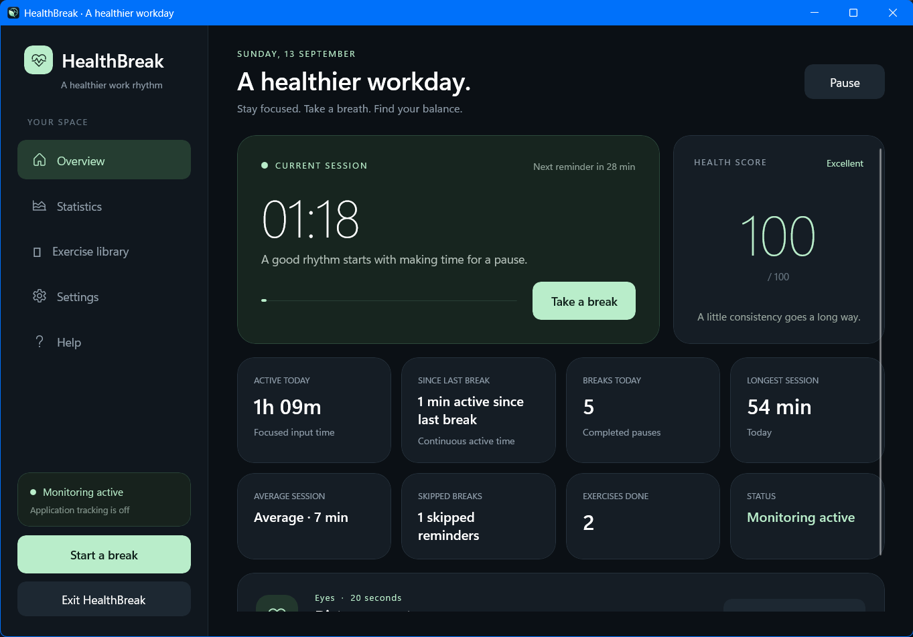
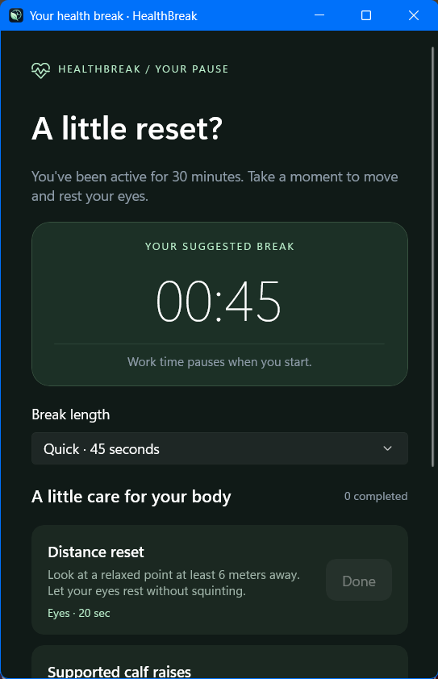
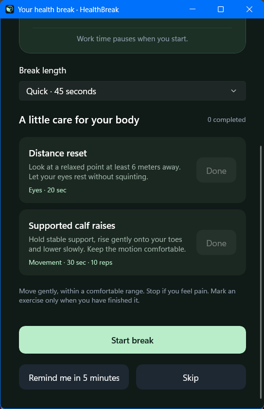
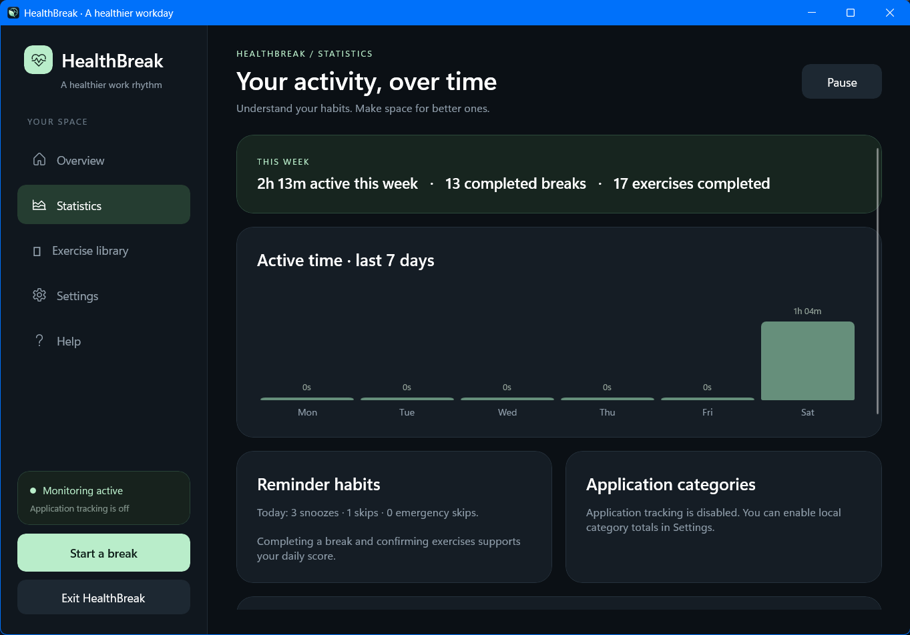
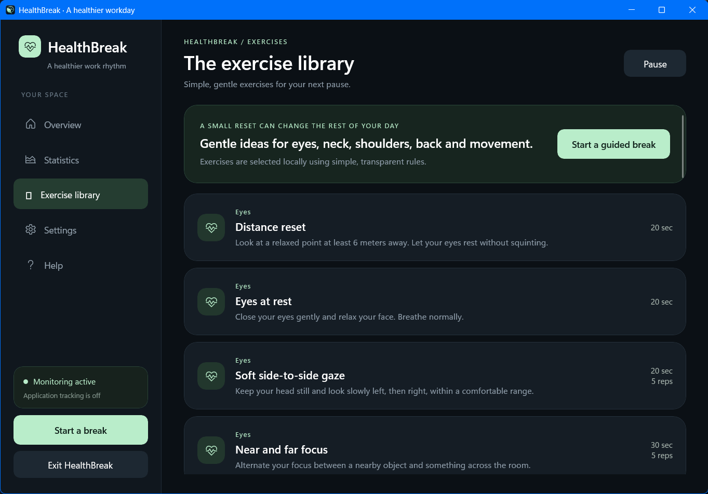
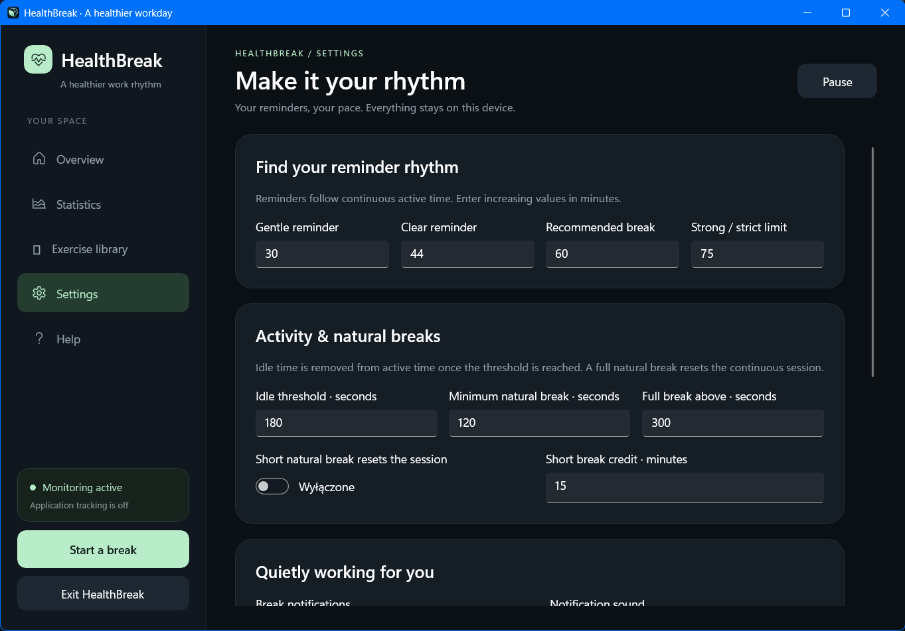
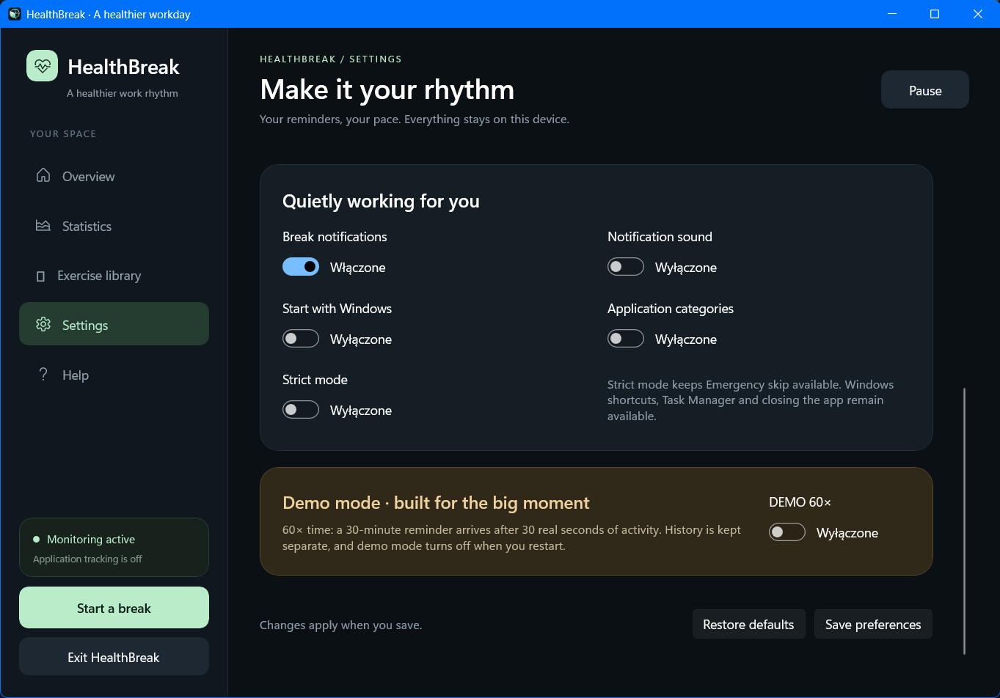
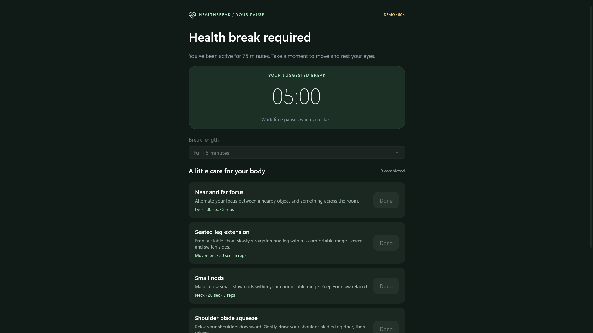
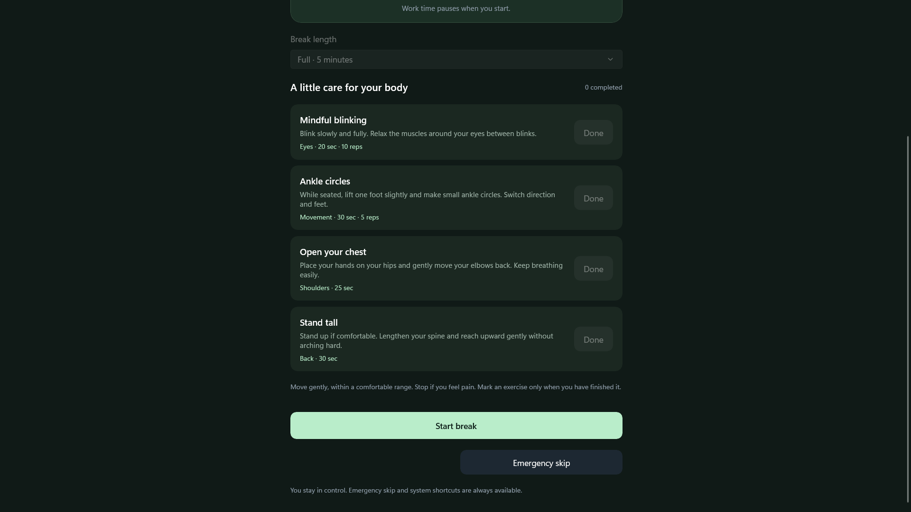

[English](README.md) | [Polski](README.pl.md)

# HealthBreak

A local Windows desktop application that helps users take regular breaks from the computer. It measures mouse and keyboard activity using the timestamp of the last input event, detects inactivity, suggests breaks, and guides the user through simple exercises.

The project uses the specified stack: **C# 12, .NET 8, WinUI 3, and Windows App SDK**. Requirements related to Python, Qt, QSS, and signals/slots were treated as remnants of an alternative specification: the application uses XAML, MVVM, and UI-thread communication through `DispatcherQueue`. It does not require Python.

## Features

- Dashboard showing active time, current session, time since the last break, number of breaks, average and longest session, skipped reminders, and completed exercises.
- Four reminder levels: by default after 30, 45, 60, and 75 minutes, with options to start a break, snooze for 5 minutes, or skip.
- Quick, Short, and Full breaks, a library of more than 20 eye, neck, shoulder, back, and movement exercises, plus manual completion confirmation.
- Rule-based exercise selection that considers work duration, recent suggestions, skipped items, and category diversity.
- Statistics with a daily summary, 7-day history, and local SQLite storage.
- Settings for thresholds, notifications, sound, autostart, application-category tracking, and Strict Mode.
- A system tray icon for opening the dashboard, starting a break, pausing/resuming monitoring, opening settings, and exiting the application.
- A clearly marked, optional **Demo Mode ×60** for hackathon presentations.

## Requirements

- Windows 10 version 1809 or later, or Windows 11; x64 architecture.
- To build: .NET SDK 8 or later and PowerShell. Visual Studio is not required to run the scripts; Visual Studio with WinUI support can be used for IDE development.
- NuGet access during the first dependency restore. After the application is built, it runs locally without cloud services, API keys, an account, or an internet connection.

## Installation and running from source

Open PowerShell in the project directory:

```powershell
dotnet --info
./scripts/run.ps1
```

The script restores dependencies, builds the x64 version, and launches `HealthBreak.App.exe`. It does not enable autostart or install a service. Build output is placed in the standard directory `src/HealthBreak.App/bin/x64/Debug/net8.0-windows10.0.19041.0/win-x64`. Keeping the standard directory structure is required by WinUI XAML resources.

Example of running the application with a separate data directory for a presentation:

```powershell
./scripts/run.ps1 -DataDir ./artifacts/demo-data
```

Script options: `-Configuration Release`, `-Background`, `-NoRestore`. The `-NoRestore` option requires dependencies to have been successfully restored beforehand.

If the local PowerShell policy blocks script execution, you can run a single script without permanently changing the system policy:

```powershell
powershell -NoProfile -ExecutionPolicy Bypass -File ./scripts/run.ps1
```

## Build for distribution

```powershell
./scripts/publish.ps1
```

The ready-to-distribute directory is `artifacts/HealthBreak-win-x64`. It contains the application, the .NET runtime, and Windows App SDK. Distribute the **entire directory**, then launch `HealthBreak.App.exe`. The EXE file alone is not sufficient. The target computer does not need the SDK. This is a portable build without an installer or commercial code signing.

Application arguments:

```powershell
./HealthBreak.App.exe --data-dir "D:/HealthBreakData"
./HealthBreak.App.exe --background
```

`--background` starts the application in the system tray. `--data-dir` points to a local database directory instead of the default one. In normal mode, closing the main window leaves monitoring active in the tray; **Exit** terminates the application. If the tray icon is unavailable, the application should remain accessible through its window.

## How time is measured

`GetLastInputInfo` reports when the last mouse or keyboard event occurred. The application does not capture individual keystrokes. This is a measure of input activity: simply watching a video or reading without touching the input devices may be treated as inactivity.

The default idle threshold is 180 seconds. Inactive time before the threshold decision is temporary; once a longer idle period is detected, it is corrected to idle time. This prevents the three minutes spent waiting for the threshold from being artificially counted as work. Locking the desktop, disconnecting the session, or a gap in sampling does not add work time.

A natural break is recorded after activity resumes:

| Inactivity | Default interpretation |
| --- | --- |
| Less than 2 minutes | Not a break |
| From 2 to 5 minutes inclusive | Short break |
| More than 5 minutes | Full break |

The minimum break length and idle threshold are independent settings. Every completed guided break (Quick, Short, or Full) resets the current-session counter and starts a new reminder cycle. By default, a naturally detected short idle break reduces the continuous-work counter by 15 minutes; this relief value can be changed, or full reset can be selected. This adjustment does not subtract actual worked time from the daily total.

| Guided break | Duration | Default suggestion |
| --- | --- | --- |
| Quick | 45 seconds | From the first threshold to the second, by default 30–44 min |
| Short | 2 minutes 30 seconds | From the second threshold to the strong threshold, by default 45–74 min |
| Full | 5 minutes | From the strong threshold, by default from 75 min onward |

A break is not counted as completed before its duration has elapsed. Exercise confirmation is a voluntary user declaration and is independent of the timer.

## Exercises and Health Score

The exercise library is located at `src/HealthBreak.Core/Data/exercises.json`. Each entry contains an identifier, name, category, description, suggested duration, and optional repetitions. The file is embedded in the application.

The selector is deterministic. It starts with 100 points per exercise, rewards exercises that have not been used or have not been suggested recently, and rewards categories suited to the session. It subtracts points for recent suggestions, skips, duplicated categories, and movement exercises appearing in the last three breaks. After 45 minutes, it prefers eye exercises; from 60 minutes onward, it considers eyes and movement; from 90 minutes onward, it also adds neck or shoulder exercises. Ties are resolved by exercise identifier. It does not use ML or AI.

Health Score is a **habit indicator** calculated for the selected day:

```text
L = max(longest saved session, current session), in minutes
score = 100
        - min(35, 0.4 × max(0, L - 45))
        - min(40, 3 × skipped reminders)
        - min(12, 1.5 × snoozes)
        - min(16, 4 × emergency skips)
        + min(20, 4 × completed breaks)
        + min(20, 2 × completed exercises)
```

The result is limited to 0–100 and rounded. Penalties are capped, so a single bad day does not make it impossible to improve the score. Every completed break and exercise provides a visible bonus; manually opening and closing the break preview is not counted as a dismissed reminder. An Emergency skip also counts as a skip and receives an additional penalty. Statuses: **Excellent** 80–100, **Good** 60–79, **Needs attention** 40–59, and **Poor** 0–39. Long sessions are not a diagnosis; the score does not assess the user's health condition.

## Strict Mode and autostart

Strict Mode is disabled by default. After the final reminder threshold, it displays a full-screen prompt for the required break with exercises. The **Emergency skip** button remains available and records the event in the statistics. The program does not block Windows shortcuts, Alt+Tab, or Task Manager, and it does not install keyboard hooks. It can be closed safely.

Autostart is disabled by default. Saving the corresponding option adds only the current user's `HKCU/Software/Microsoft/Windows/CurrentVersion/Run/HealthBreak` entry, pointing to the current EXE with the `--background` argument. Disabling the option removes this entry. After moving the application, autostart must be saved again from the new location.

## Demo Mode

Enable **Demo Mode** in the application. One real second corresponds to one minute of application time. The first reminder appears after about 30 seconds of active work, and the 60-minute threshold is reached after about one minute.

Demo Mode also scales idle time and break duration. With the default settings, 3 seconds without input equals 3 minutes of idle time, so while demonstrating an increasing session timer, move the mouse or use the keyboard at least every 1–2 seconds. Demo Mode is always clearly marked, is not enabled by default, and is not saved as a preference for the next launch. Demo data has `is_demo=1` and is separated from normal-use data in the statistics. Detailed scenario: [docs/DEMO.md](docs/DEMO.md).

## Architecture

```text
HealthBreak.sln
src/
  HealthBreak.Core/
    Models/                  models and settings validation
    Services/                SessionManager, BreakManager, ExerciseSelector, HealthScore
    Data/exercises.json      embedded exercise library
  HealthBreak.Data/
    DatabaseSchema.cs        SQLite schema and versioning
    HealthRepository.cs      transactions, statistics, settings, and history
  HealthBreak.App/
    Services/Native/         Win32 input, process, tray, autostart, window, and sound
    Assets/HealthBreak.ico   window, taskbar, tray, and EXE icon
    Resources/Theme.xaml     colors, typography, and styles
    MainWindow.xaml          UI shell
    App.xaml                 WinUI resources and startup
 tests/
  HealthBreak.Core.Tests/    deterministic time and rule scenarios
  HealthBreak.Data.Tests/    database, aggregation, and persistence
scripts/                     run, publish, and test scripts
docs/                        demo and Windows verification checklist
```

The Core layer does not depend on WinUI or the Windows API. Monitoring and database operations are handled by a background coordinator; the UI receives state through the UI queue. Shutdown stops background work, saves changes, releases SQLite, and removes the tray icon and window subclass. The native tray uses `Shell_NotifyIcon` and restores the icon after Explorer restarts. The **Help** screen in the side navigation explains time measurement, reminders, break types, Health Score, Demo Mode, and privacy rules.

Technologies: C# 12, .NET 8, WinUI 3 / Windows App SDK, XAML, CommunityToolkit.Mvvm, Microsoft.Data.Sqlite, SQLite, and Win32 P/Invoke. The weekly chart is rendered by the XAML UI; QtCharts and matplotlib are not required.

## Data and privacy

Default database: `%LOCALAPPDATA%/HealthBreak/healthbreak.db`. SQLite stores sessions, breaks, exercises, confirmations, reminder actions, and settings. The database uses transactions, SQL parameters, constraints, foreign keys, WAL mode, and full write synchronization. After an unexpected shutdown, open sessions end at the last saved measurement point.

The program regularly creates a verified backup at `healthbreak.db.backup`. On every startup, it checks database integrity and foreign-key relationships. If the database is corrupted, HealthBreak preserves it as `healthbreak.db.corrupt-DATA`, restores the latest valid backup, and if the backup cannot be used, creates a new valid database and shows a message in the application. The backup is first created as a temporary file and replaces the previous backup only after successful verification, so an interrupted backup write does not destroy the last recovery copy.

Active-application tracking is **disabled by default**. When enabled, only the process name of the active window is read, and category totals are stored in the database: Work, Browser, Gaming, Communication, Development, Entertainment, and Other. The process name is used for the current view and classification. Window titles, website addresses, document contents, clipboard data, screenshots, and keystrokes are not collected. The program does not use the camera, image analysis, external APIs, or cloud services.

SQLite files and their backups are not encrypted; they are protected by Windows account permissions. To make an additional manual backup, exit the application using **Exit**, then copy the data directory. Deleting the data directory after closing the application resets the history and settings.

## Screenshots

- Dashboard: dark interface, time cards, and Health Score



- Reminder popup and exercise window

 

- Statistics: daily values and 7-day history



- Exercise library



- Settings and the Demo Mode option




- Strict Mode with the Emergency skip button.




## Testing

```powershell
./scripts/test.ps1
```

The script runs the Core and SQLite tests. `RollForward=Major` allows the test host to run even when a newer .NET runtime is installed. TRX results are written to `artifacts/TestResults`. The status of completed checks and scenarios requiring an interactive Windows environment are described in [docs/TESTING.md](docs/TESTING.md). Passing unit tests alone does not replace testing the window, tray, and Windows lock behavior on a real desktop.

## Medical information

HealthBreak is not a medical device and does not provide medical advice. It offers general reminders and gentle exercises; the user decides whether to perform them. Do not perform movements that cause pain. Choose exercises appropriate to your abilities and follow the recommendations of your healthcare provider, if applicable.
